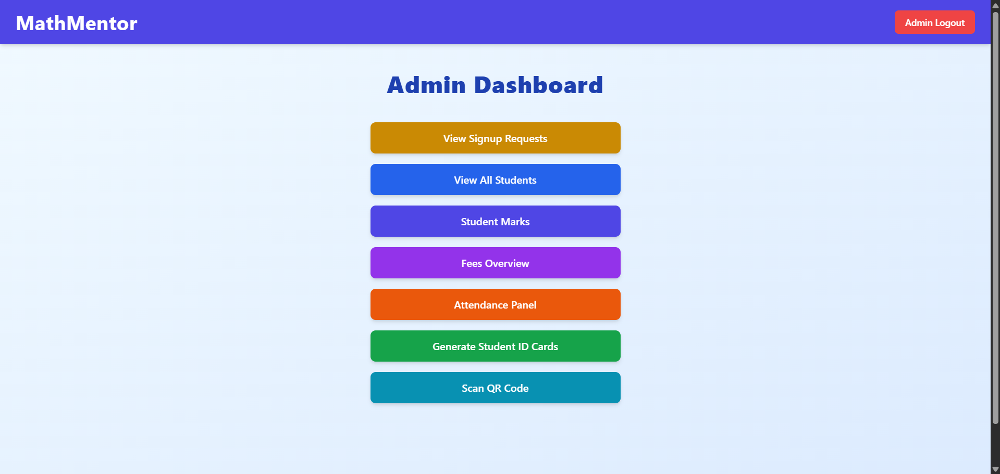
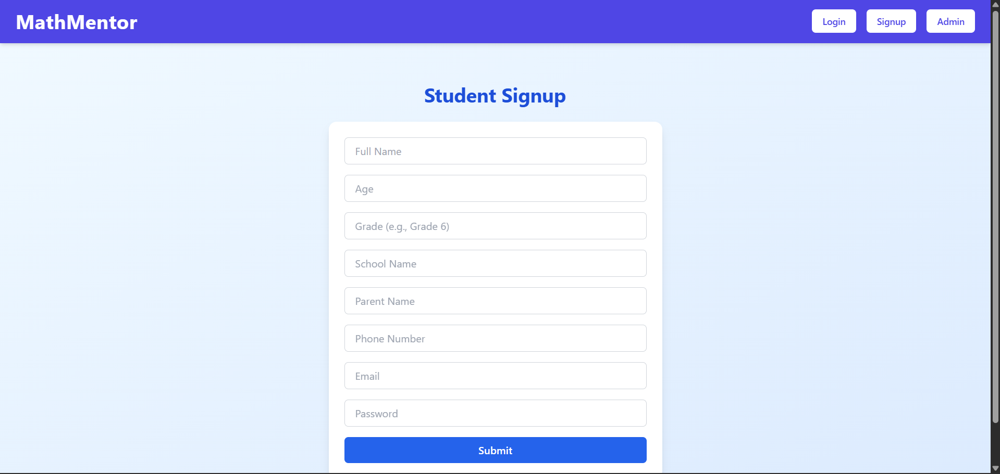

# MathMentor: Custom LMS for Mathematics Tuition Classes (Grades 6–11)

---

## Project Overview

MathMentor is a full-stack Learning Management System (LMS) tailored specifically for managing private mathematics tuition classes for grades 6 to 11. This platform empowers a single admin (the tutor) to manage students, track attendance via QR codes, handle fee payments, record academic progress, and visualize performance data — all in one intuitive dashboard.

This project demonstrates my skills in modern web development, authentication flows, real-time attendance systems, data visualization, and deployment using industry-standard tools and best practices.

---

## Features

### Admin Capabilities
- View and manage pending student signup requests (approve/reject).
- Generate unique student IDs and QR codes for attendance tracking.
- Add, edit, and delete student records.
- Scan QR codes to mark student attendance in real-time.
- Input monthly and term test marks for students.
- Manage monthly fee payments and track payment history.
- Visualize student attendance, marks, and fees through interactive charts.
- Receive notifications about low attendance or unpaid fees.

### Student Capabilities
- Secure sign-up (pending admin approval).
- Login to view personal profile, attendance, fee history, and academic performance.
- Visual analysis of monthly and term test marks.
- Ability to reset password securely via Firebase Authentication.
  
---

## Technologies Used

| Layer          | Technology               | Purpose                                        |
|----------------|--------------------------|------------------------------------------------|
| Frontend       | React.js + Tailwind CSS  | Component-based UI and responsive styling      |
| Data Visualization | Chart.js / Recharts   | Interactive charts for analytics                |
| Backend        | Node.js + Express.js     | REST API and server-side logic                   |
| Database       | MongoDB Atlas            | Cloud-hosted NoSQL data storage                  |
| Authentication | Firebase Authentication  | Secure email/password login and password reset |
| QR Code        | qrcode + html5-qrcode    | Generating and scanning QR codes for attendance |
| Deployment     | Vercel (frontend), Railway (backend) | Cloud hosting with CI/CD integration  |
| Version Control| Git + GitHub             | Source code management and collaboration         |

---

## Architecture Overview

- **Frontend:** React SPA consuming RESTful APIs, featuring protected routes and role-based access.
- **Backend:** Express API server handling business logic, authentication, and data persistence.
- **Database:** MongoDB Atlas collections for students, attendance, marks, fees, and signup requests.
- **Authentication:** Firebase manages secure user sign-up, login, and password reset flows.
- **QR Attendance:** QR code generation for each student and live QR code scanning for attendance marking.
- **Deployment:** Hosted on Vercel (frontend) and Railway (backend) with automated deployments on GitHub pushes.

---

## Screenshots

### 1. Admin Dashboard  

### 2. Student Signup Requests  

### 3. Attendance QR Scanner  

### 4. Student Performance Charts  

### 5. Student Dashboard  

---

## 🚀 Future Plans

- **Mobile App:** Develop a React Native app for student access on-the-go.
- **Notifications:** Real-time email/SMS reminders for fee dues and attendance alerts.
- **Reports Export:** Enable PDF and Excel report downloads for admin and students.
- **Role Expansion:** Add teacher role for class assistants with limited permissions.
- **Analytics Enhancements:** Advanced filtering, predictive analytics on student performance.
- **Localization:** Support for multiple languages based on user preferences.

---

## Repository Structure (Private Repo)

- `/client` – React frontend source code
- `/server` – Express.js backend API code
- `/public/uploads` – QR codes and static assets
- `.env` – Environment variables (excluded from public repo)
- `README.md` – Project documentation (this file)

---

## Accessing the Source Code

The full source code of the MathMentor LMS is currently **private** to protect sensitive data and ensure integrity during ongoing development.

**If you are a recruiter, employer, or collaborator interested in reviewing the codebase, please reach out to me at:**

**[your-email@example.com]**  
**LinkedIn:** [https://www.linkedin.com/in/your-profile](https://www.linkedin.com/in/your-profile)  
**Phone:** +94 XX XXXXXXX

_I am happy to provide private access or share the code upon request._

---

## About Me

I am an undergraduate Software Engineering student passionate about building full-stack applications with real-world impact. This project, MathMentor, reflects my skills in:

- Modern frontend and backend development
- Secure authentication and role-based access control
- Real-time features like QR code attendance
- Data visualization and analytics dashboards
- Cloud deployment and continuous integration

I am seeking internship opportunities where I can apply and expand these skills, contribute to impactful projects, and grow as a software engineer.

---

## Connect with Me
- GitHub: https://github.com/yourusername
- LinkedIn: https://www.linkedin.com/in/your-profile
- Email: your-email@example.com

## License
This project is for personal and portfolio use. Please contact me for collaboration or commercial usage.
