# 📚 MathMentor: Custom LMS for Mathematics Tuition Classes (Grades 6–11)

---

## 🎓 Project Overview

**MathMentor** is a role-based, full-stack Learning Management System (LMS) developed to streamline and digitize the daily operations of a private mathematics tuition class. Built entirely by me, this project is not only actively used in my own tuition classes but also showcases my professional software development skills.

The system allows a single admin (tutor) to manage students, approve signups, mark attendance, enter monthly and term marks, track fee payments, and analyze student performance with charts. It uses secure login mechanisms and QR technology for seamless real-time attendance and record handling.

This project was developed using the **Software Development Life Cycle (SDLC)** phases: Requirements Gathering, System Design, Implementation, Testing, Deployment, and Maintenance.

---

## ✨ Key Features

### 👨‍🏫 Admin (Tutor) Functionalities
- ✅ Accept/reject student signup requests
- ✅ Auto-generate unique student IDs
- ✅ Generate & scan QR codes to mark:
  - Attendance 🗕️
  - Monthly & Term Marks 🧪
  - Fee Payments 💰
- ✅ Enter and update monthly & term test marks
- ✅ Input and track monthly fee payments
- ✅ Visual dashboards with:
  - Attendance trends
  - Fee payment completion
  - Marks comparison
- ✅ Alerts & Row Highlights:
  - Marks < 75% appear in **red**
  - Outdated fee payments (older than current month) appear in **red**

### 👨‍🎓 Student Functionalities
- 🔐 Secure login (JWT-based) after admin approval
- 👤 View personal profile details
- 📊 Visualized performance reports:
  - Monthly & Term Marks
  - Attendance Summary
  - Fee Payment History
- 🔁 Password reset via Firebase Authentication

---

## 🚀 Technologies Used

| Layer             | Technology                        | Purpose                                               |
|------------------|-----------------------------------|-------------------------------------------------------|
| Frontend         | React.js + Tailwind CSS           | Component-based SPA with modern responsive UI         |
| Backend          | Node.js + Express.js              | REST API & server logic                               |
| Database         | MongoDB Atlas                     | Cloud NoSQL storage for students, marks, fees, etc.   |
| Authentication   | Firebase Authentication + JWT + backend logics     | Secure login, session handling, password resets       |
| QR Attendance    | qrcode + html5-qrcode             | QR code generation and scanning                       |
| Charts           | Chart.js                          | Visual analytics: marks, attendance, fees             |
| Deployment       | Vercel (Frontend) + Railway (Backend) | CI/CD, Free Hosting using GitHub Student Pack     |
| Version Control  | Git + GitHub                      | Source code management and collaboration              |

---

## 📄 System Architecture

- **Frontend**: React SPA with protected routes for students/admins
- **Backend**: Express REST API managing authentication & data
- **Database**: MongoDB collections for students, marks, fees, attendance
- **Authentication**: Firebase Auth for password resets and backend logic to handle login; JWT for sessions
- **QR Scanning**: Web scanner for marking attendance/marks/fees
- **Charts**: Chart.js integration for analytical graphs
- **Deployment**: Hosted using GitHub, Vercel (frontend), Railway (backend)

---

## 🜐 Screenshots (Placeholders)

### 1. Admin View
- 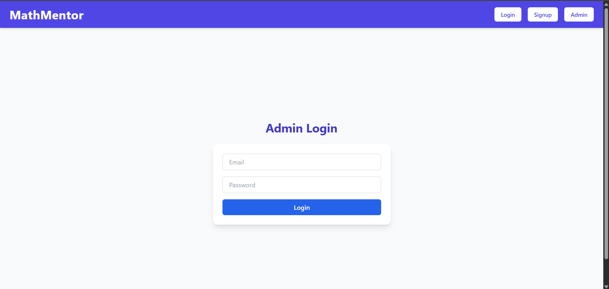
- 
- 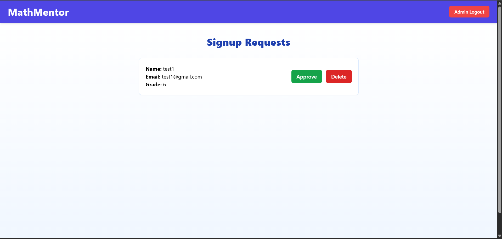
- 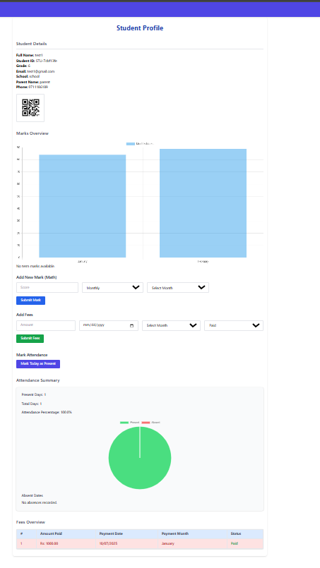
- 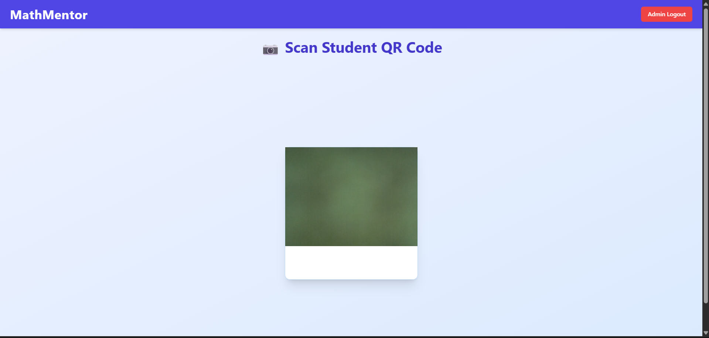
- 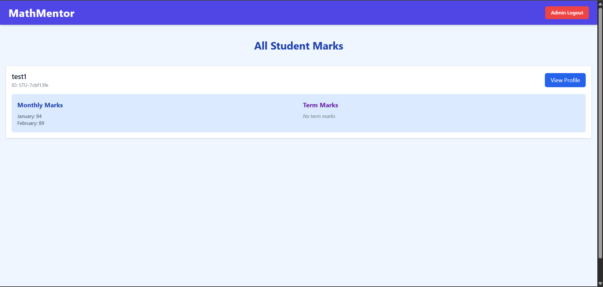

### 2. Student View
- 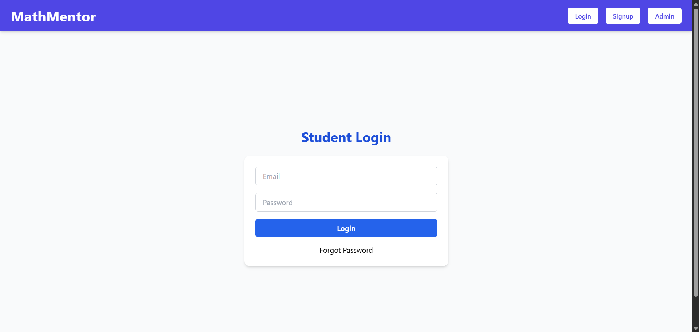
- 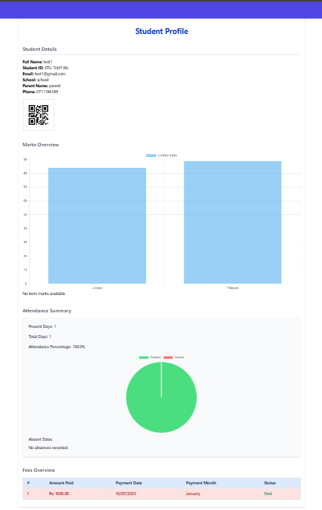
- 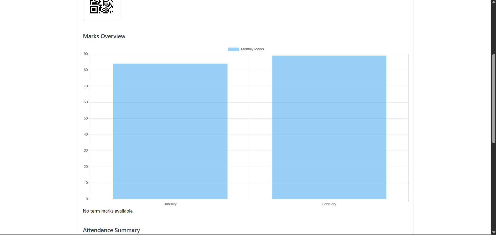
- 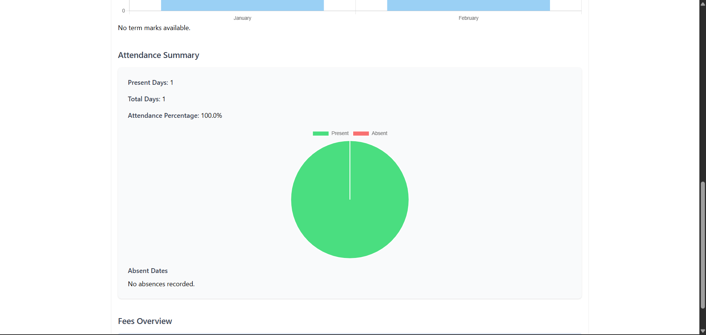
- 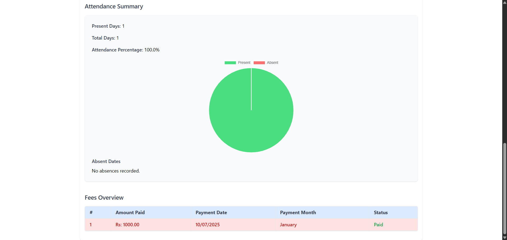

### 3. Charts & Reports
- 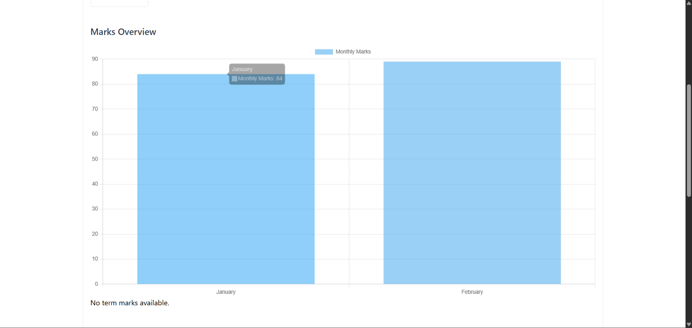
- 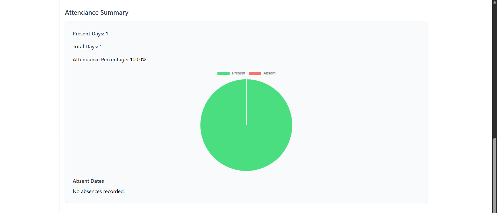
- 

---

## 🚀 Future Enhancements

- 📱 Mobile App (React Native)
- 📧 Real-time Notifications for low marks or unpaid fees
- 🔢 Export Reports as PDF or Excel
- 🤝 Additional User Roles (e.g., Assistants)
- 🌐 Localization Support
- ⚖️ Advanced Filtering & Predictive Analytics

---

## 🔍 Access to Code

The full project code is **private** to protect credentials and maintain academic integrity.

### 🚑 Contact Me to Request Access:
- Email: randilgimantha646@gmail.com
- LinkedIn: [https://www.linkedin.com/in/your-profile](https://www.linkedin.com/in/randil-welikala-03336b249/)

---

## 👤 About Me

I am an **undergraduate Software Engineering student** passionate about developing real-world software solutions. MathMentor was built to automate and simplify operations in my own tuition class, and it reflects:

- Mastery in full-stack development
- Real-time systems using QR code
- Modern UI/UX & charts-based analytics
- Authentication & secure data handling
- Hosting, CI/CD, and Git workflows

---

## 💬 Connect with Me

- GitHub: [github](https://github.com/Randilwelikala/Mathmentor-details.git)
- LinkedIn: [linkedin]([https://www.linkedin.com/in/your-profile](https://www.linkedin.com/in/randil-welikala-03336b249/))
- Email: randilgimantha646@gmail.com

---

## 📄 License

This project is intended for **personal and portfolio** use. Please contact me for permission regarding any collaboration or commercial usage.

---

> ✨ _Thank you for visiting MathMentor! Feel free to explore, connect, and collaborate._
